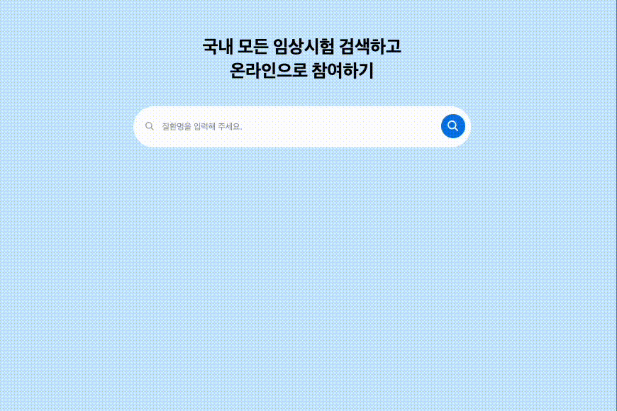

<br/>

# 목차

[1. 배포](#배포)
<br/>
[2. 프로젝트 실행 방법](#프로젝트-실행-방법)
<br/>
[3. 기술 스택과 폴더 구조](#기술-스택)
<br/>
[4. 기능 구현](#기능-구현)

> [1. 검색어 추천 기능](#1-검색어-추천-기능)

> [2. 로컬 캐싱](#2-로컬-캐싱)

> [3. API 호출 횟수 줄이는 전략](#3-API-호출-횟수를-줄이는-전략)

> [4. 키보드만으로 검색어 이동](#4-키보드만으로-검색어-이동)

> [5. 최근 검색어 기능](#5-최근-검색어-기능)

[5. 회고](#회고)

<br/>

# 배포

### [원티드 프리온보딩 인턴십 4주차 과제 - 배포 링크](https://www.example.com/)

<br/>

## 프로젝트 실행 방법

1. 프로젝트 clone

```bash
$ git clone https://github.com/gamangee/pre-onboarding-11th-4-13.git
```

2. 프로젝트 directory로 이동

```bash
 $ cd pre-onboarding-11th-4-13
```

3. 프로젝트 관련 라이브러리 다운로드

```bash
$ npm install
```

4. 프로젝트 실행

```bash
$ npm start
```

<br/>

## 기술 스택


<br/>

## 📂 폴더 구조

```bash
src
 ┣ assets
 ┃ ┗ icons.tsx
 ┣ components
 ┃ ┣ SearchPopup.tsx
 ┃ ┣ SearchResultItem.tsx
 ┃ ┗ SearchSickNm.tsx
 ┣ hooks
 ┃ ┣ useKeyboard.tsx
 ┃ ┣ useSearchHistory.tsx
 ┃ ┗ useSearchQuery.tsx
 ┣ service
 ┃ ┗ searchAPI.tsx
 ┣ utils
 ┃ ┗ localCacheStorage.tsx
 ┣ App.tsx
 ┣ index.css
 ┣ main.tsx
 ┗ vite-env.d.ts
```

<br/>

# 기능 구현

## 1. 검색어 추천 기능

### 1-1. 질환명 검색하는 API

```typescript
class searchSickNmAPI {
  private axiosInstance: AxiosInstance;

  constructor() {
    this.axiosInstance = axios.create({
      baseURL: BASE_URL,
    });
  }

  async getSickNmList(searchKeyword: string) {
    if (searchKeyword === '') return [];

    const completeAPIUrl = `${API_URL}${searchKeyword}`;

    const { data } = await this.axiosInstance.get(completeAPIUrl);

    return data.filter((item: SickNmListProps) =>
      item.sickNm.startsWith(searchKeyword)
    );
  }
}
```

✅ 입력창의 검색어를 searchKeyword라는 매개변수로 전달 받아 API요청 url을 완성합니다.
<br/>
✅ 검색어가 없을 때는 빈배열을 반환하여 전체 데이터를 받아오지 않도록 하였습니다.
<br/>
✅ filter 함수를 사용하여 검색 결과에서 검색어로 시작하는 항목만 반환하였습니다.

### 1-2. 검색어가 없을 시 “검색어 없음” 표시

```typescript
{
  isLoading ? (
    <h2 className="text-sm text-darkGray px-7">검색중</h2>
  ) : recommendedSickNms.length > 0 ? (
    <ul>
      {recommendedSickNms.map(({ sickCd, sickNm }, index) => (
        <SearchResultItem
          key={sickCd}
          searchValue={debouncedAndThrottledSearchValue}
          resultKeyword={sickNm}
          directSearch={directSearch}
          onKeyboard={selectIndex === index}
          setSelectIndex={setSelectIndex}
          fontBold={true}
        />
      ))}
    </ul>
  ) : (
    <h2 className="text-sm text-lightGray px-7 mt-3">검색어 없음</h2>
  );
}
```

✅ 추천 검색어 데이터를 받아 오는 상태 즉 로딩중일 때는 `검색중`이라는 텍스트가 표시됩니다.
<br/>
✅ 추천 검색어 데이터를 받아왔지만 빈 배열일 경우에는 `검색어 없음` 이라는 텍스트가 표시 됩니다.
<br/>

## 2. 로컬 캐싱

### 2-1. 💸 사용자의 요청에 빠르게 응답하기 위해 이전의 요청 결과를 저장해 두는 전략 세우기

1️⃣ API 호출에 대한 응답을 캐시하고, 동일한 API 요청이 다시 들어왔을 때 캐시에서 응답을 반환합니다.
<br/>
2️⃣ 만약 캐시된 응답이 만료 시간을 넘으면 캐시에서 해당 응답을 제거하고, 다시 신규 데이터를 가져옵니다.
<br/>
3️⃣ 만료시간을 설정하여 캐시 데이터가 오래되지 않도록 적용하여 최신 데이터를 유지합니다.
<br/>

### 2-2. 캐싱된 응답의 만료 시간 확인하기

```typescript
const checkCacheExpireTime = (cacheResponse: Response) => {
  const cachedDate = cacheResponse.headers.get(FETCH_DATE);
  if (!cachedDate) return;

  const fetchDate = new Date(cachedDate).getTime();
  const today = Date.now();

  return today - fetchDate > EXPIRE_TIME;
};
```

✅ 응답 헤더에서 FETCH_DATE를 얻어와 이를 Date 객체로 변환한 후, 현재 시간과 비교하여 만료 시간을 넘었는지 확인합니다.
<br/>

### 2-3. API 캐싱 여부 파악하기

```typescript
const checkCachedResponse = async (completeAPIUrl: string) => {
  const cacheName = completeAPIUrl.replace(BASE_URL, '');
  const cacheStorage = await caches.open(cacheName);
  const cachedResponse = await cacheStorage.match(completeAPIUrl);

  if (cachedResponse) {
    if (!checkCacheExpireTime(cachedResponse)) {
      return cachedResponse;
    } else {
      await cacheStorage.delete(completeAPIUrl);
    }
  }

  return null;
};
```

✅ 호출하는 API가 캐싱된 응답이 있는지 확인하고, 캐시가 있으면 만료 시간이 지났는지를 확인합니다.
<br/>
✅ 만약 캐시가 만료되지 않았다면 캐시된 응답을 반환하고, 만료된 경우에는 캐시에서 해당 항목을 제거합니다.

### 2-4. API 캐싱하기

```typescript
const setCacheStorage = async (
  completeAPIUrl: string,
  data: SickNmListProps[]
) => {
  const cacheName = completeAPIUrl.replace(BASE_URL, '');
  const cacheStorage = await caches.open(cacheName);
  const response = new Response(JSON.stringify(data));

  const copiedResponse = response.clone();
  const newHeaders = new Headers(copiedResponse.headers);
  newHeaders.set(FETCH_DATE, new Date().toISOString());

  const newResponse = new Response(copiedResponse.body, {
    status: copiedResponse.status,
    statusText: copiedResponse.statusText,
    headers: newHeaders,
  });

  await cacheStorage.put(completeAPIUrl, newResponse);
};
```

✅ 특정 URL과 그에 대응하는 데이터를 입력받아, 새로운 응답 객체를 생성하고, 이 객체의 FETCH_DATE 헤더를 현재 시간으로 설정한 후에 캐시를 저장합니다.
<br/>

### 2-5. API 호출 시 캐싱 적용

```typescript
class searchSickNmAPI {
  private axiosInstance: AxiosInstance;
  constructor() {
    this.axiosInstance = axios.create({
      baseURL: BASE_URL,
    });
  }
  async getSickNmList(searchKeyword: string) {
    if (searchKeyword === '') return [];

    const completeAPIUrl = `${API_URL}${searchKeyword}`;

    const cacheRes = await checkCachedResponse(completeAPIUrl);
    if (cacheRes) {
      const cacheData = await cacheRes.json();
      return cacheData.filter((item: SickNmListProps) =>
        item.sickNm.startsWith(searchKeyword)
      );
    }

    try {
      const { data } = await this.axiosInstance.get(completeAPIUrl);
      // 콘솔창에서 API 호출 횟수 확인이 가능하도록 설정하였습니다.
      console.info('calling API');
      setCacheStorage(completeAPIUrl, data);

      return data.filter((item: SickNmListProps) =>
        item.sickNm.startsWith(searchKeyword)
      );
    } catch (error) {
      const axiosError = error as AxiosError<ErrorResponse>;
      alert(axiosError.response?.data.message || ERROR_MESSAGE);
      return [];
    }
  }
}
```

✅ 추천 검색어 API 데이터를 받아 오기 전에 먼저 url을 확인하여 캐시 여부를 확인합니다.
<br/>
✅ 캐시된 응답이 있다면 이전 데이터를 사용하고, 없다면 API를 호출하여 응답 데이터를 캐시에 저장합니다.
<br/>

### 2-6. 기대 효과

💰 동일한 요청이 여러 번 들어왔을 때, 매번 네트워크를 통해 서버에 접근하지 않아도 되므로 응답 속도를 크게 향상시킬 수 있습니다.
<br/>
💰 서버로의 재요청을 방지하여 네트워크 트래픽을 줄일 수 있습니다.

## 3. API 호출 횟수를 줄이는 전략

### 3-1. 입력마다 API 호출할 때 문제

1. 사용자가 타이핑하는 속도에 비해 응답이 느릴 수 있고, 사용자가 입력한 내용과는 다르게 API 응답이 다를 수 있다.
2. API 요청이 많아진다는 것은 서버에 요청을 많이 하는 것과 같기 때문에 서버에 과부하를 일으킬 수 있다.
3. 많은 요청은 사용자의 데이터를 소모하고, 사용자 경험에도 좋지 않다.

### [3-2. 전략1. 로컬 캐싱](#2-로컬-캐싱)

필수 구현 조건과 별개로 로컬 캐싱 또한 API 호출을 줄이는 전략 중의 하나입니다.
<br/>
자세한 설명은 [2. 로컬 캐싱] 탭에 자세히 기재하였습니다.
<br/><br/>
👉 [로컬 캐싱 바로가기](#2-로컬-캐싱)
<br/>

### 3-3. 전략2. 디바운싱

✨ `디바운싱(Debouncing)이란?`
<br/>
이벤트가 여러 번 발생하는 경우, 초기 이벤트 이후에 발생한 이벤트들을 무시하고 일정 시간이 지난 후에 마지막 이벤트를 처리하는 기술입니다.

🌟 `사용 이유`
<br/>사용자가 검색어를 입력할 때마다 API 호출을 하는 대신에 디바운싱을 사용하면, 사용자가 입력을 중지하고 일정 시간이 지난 후에만 API 호출을 하기 때문에 API 요청 횟수를 줄일 수 있습니다.

```typescript
const useSearchQuery = ({ value, delay }: SearchSuggestionsProps) => {
  const [searchValue, setSearchValue] = useState(value);

  useEffect(() => {
    const timer = setTimeout(() => {
      setSearchValue(value);
    }, delay);

    return () => {
      clearTimeout(timer);
    };
  }, [value, delay]);

  return searchValue;
};

export default useSearchQuery;
```

✅ 사용자가 검색어를 입력할 때 지연 시간을 주어, 검색 이벤트가 자주 발생하는 것을 방지 하였습니다.
<br/>

## 4. 키보드만으로 검색어 이동

```typescript
const useKeyboard = (
  recommendedSickNms: SickNmListProps[],
  isOpenPopup: boolean,
  searchHistory: string[],
  handleSearchValue: (searchSickNm: string) => void,
  setIsOpenPopup: React.Dispatch<React.SetStateAction<boolean>>,
  setSearchValue: React.Dispatch<React.SetStateAction<string>>
) => {
  const [selectIndex, setSelectIndex] = useState<number>(-1);

  const handleKeyboard = useCallback(
    (event: KeyboardEvent) => {
      if (!isOpenPopup) return;
      if (event.isComposing) return;

      if (event.key === KEYBOARD.enter) {
        event.preventDefault();
        if (selectIndex >= 0 && selectIndex < recommendedSickNms.length) {
          const selectedItem = recommendedSickNms[selectIndex]?.sickNm;
          if (selectedItem) {
            setSearchValue(selectedItem);
            handleSearchValue(selectedItem);
            setIsOpenPopup(false);
          }
        } else if (
          selectIndex >= recommendedSickNms.length &&
          selectIndex < recommendedSickNms.length + searchHistory.length
        ) {
          const selectedItem =
            searchHistory[selectIndex - recommendedSickNms.length];
          if (selectedItem) {
            setSearchValue(selectedItem);
            handleSearchValue(selectedItem);
            setIsOpenPopup(false);
          }
        }
      }

      if (event.key === KEYBOARD.arrowUp) {
        event.preventDefault();
        setSelectIndex((prevIndex) =>
          prevIndex <= 0
            ? recommendedSickNms.length + searchHistory.length - 1
            : prevIndex - 1
        );
        return;
      }

      if (event.key === KEYBOARD.arrowDown) {
        event.preventDefault();
        setSelectIndex((prevIndex) =>
          prevIndex >= recommendedSickNms.length + searchHistory.length - 1
            ? 0
            : prevIndex + 1
        );
        return;
      }
    },
    [
      recommendedSickNms,
      selectIndex,
      isOpenPopup,
      setSearchValue,
      setIsOpenPopup,
      searchHistory,
      handleSearchValue,
    ]
  );

  return { handleKeyboard, selectIndex, setSelectIndex };
};

export default useKeyboard;
```

✅ 키보드 이벤트는 입력창에 검색어를 입력했을 때 나타나는 팝업이 열렸을 경우에만 동작합니다.
<br/>
✅ 목록의 길이를 파악하여 길이의 범위를 벗어날 시 다시 처음 인덱스로 돌아가게 설정해두었기 때문에, 사용자는 ArrowUp과 ArrowDown 키로 목록을 움직이며 선택할 수 있습니다.
<br/>
✅ Enter 키를 누르면, 3가지 동작을 하게 됩니다.

1. 사용자가 선택한 아이템의 검색어를 입력창에 표시합니다.
2. 사용자가 선태한 아이템의 검색어를 세션 스토리지에 저장하여 최근 검색어에 표시합니다.
3. 팝업을 닫습니다.
   <br/>

## 5. 최근 검색어 기능

```typescript
const useSearchHistory = () => {
  const [searchHistory, setSearchHistory] = useState<string[]>([]);

  const updateSearchHistory = (searchValue: string) => {
    setSearchHistory((prevSearchValue) => {
      if (prevSearchValue.includes(searchValue)) {
        return prevSearchValue;
      }
      const newSearchValue = [searchValue, ...prevSearchValue].slice(0, 5);

      sessionStorage.setItem(
        SEARCH_HISTORY_KEY,
        JSON.stringify(newSearchValue)
      );
      return newSearchValue;
    });
  };

  useEffect(() => {
    const hasSearchHistory = sessionStorage.getItem(SEARCH_HISTORY_KEY);
    if (hasSearchHistory) setSearchHistory(JSON.parse(hasSearchHistory));
  }, []);

  return { searchHistory, updateSearchHistory };
};

export default useSearchHistory;
```

✅ includes 함수를 사용하여 이미 검색 기록에 있는 검색어라면 기록을 업데이트 하지 않습니다.
<br/>
✅ spread 연산자와 slice를 사용하여 새로운 검색어를 검색 기록 앞쪽에 추가하고, 기록은 최대 5개까지만 저장하도록 하였습니다.
<br/>
✅ useEffect 훅을 사용하여 컴포넌트가 마운트될 때 세션 스토리지에 저장된 검색 기록을 불러와 사용자가 페이지를 새로 고침하해도 이전의 검색 기록을 볼 수 있습니다.
<br/>
✅ 검색 기록을 저장하는 커스텀 훅으로 분리하였기 때문에 사용자가 마우스로 클릭 또는 엔터키를 쳤을 때 이 훅을 불러와서 검색 기록을 저장하였습니다.
<br/>
